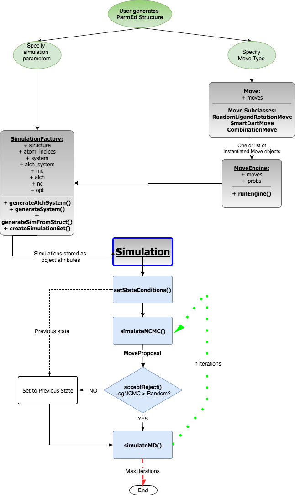

# Diagram of classes in BLUES


## Legend
-  `User Input`
-  `Core BLUES Objects`
-  `Simulation() functions`

###  `User Input`
Before running the BLUES simulation, the user is expected to have a forcefield
parameterized `parmed.Structure` of the solvated protein:ligand system.
For example, in the `blues/example.py` script we have:

```python    
#Generate the ParmEd Structure
prmtop = utils.get_data_filename('blues', 'tests/data/eqToluene.prmtop')
inpcrd = utils.get_data_filename('blues', 'tests/data/eqToluene.inpcrd')
struct = parmed.load_file(prmtop, xyz=inpcrd)
```

3 other inputs are required to generate the 3 core BLUES objects (described in more detail below):
- `Model()`
- `MoveProposal()`
- `SimulationFactory()`

In the `Model()` class, the user specifies the residue name of the _model_ object that we will
be rotating in the BLUES simulation. In the example, we are rotating the toluene ligand
in T4 lysozyme which has the residue name `'LIG'`.

```python
#Define the 'model' object we are perturbing here.
ligand = ncmc.Model(struct, 'LIG')
ligand.calculateProperties()
```

In the `MoveProposal()`, the user chooses the _move_ type and the step number to
perform the move. To select the move type, the user must provide a string of the
function name corresponding to the move. In the example, we use the string `random_rotation`
to perform a rotation about the ligand's center of mass on the step `opt['nstepsNC']` set from the options dictionary.

```python
# Initialize object that proposes moves.
ligand_mover = ncmc.MoveProposal(ligand, 'random_rotation', opt['nstepsNC'])
```

Now that we have selected the ligand, defined the NCMC move, and created their
corresponding Python objects, we generate the OpenMM Simulations in the `SimulationFactory()`.
This class takes in 3 inputs:
 1. `parmed.Structure` of the solvated protein:ligand system.
 2. `ncmc.Model` to obtain the atom indices to generate the alchemical system.
 3. `opt` is a dictionary of various simulation parameters (see below).

Snippet from the example script below:
```python
opt = { 'temperature' : 300.0, 'friction' : 1, 'dt' : 0.002,
        'nIter' : 100, 'nstepsNC' : 2, 'nstepsMD' : 1,
        'nonbondedMethod' : 'PME', 'nonbondedCutoff': 10, 'constraints': 'HBonds',
        'trajectory_interval' : 1000, 'reporter_interval' : 1,
        'platform' : 'OpenCL',
        'verbose' : True }
# Generate the MD, NCMC, ALCHEMICAL Simulation objects
simulations = ncmc.SimulationFactory(struct, ligand, **opt)
simulations.createSimulationSet()
```

###  `Core BLUES Objects`
