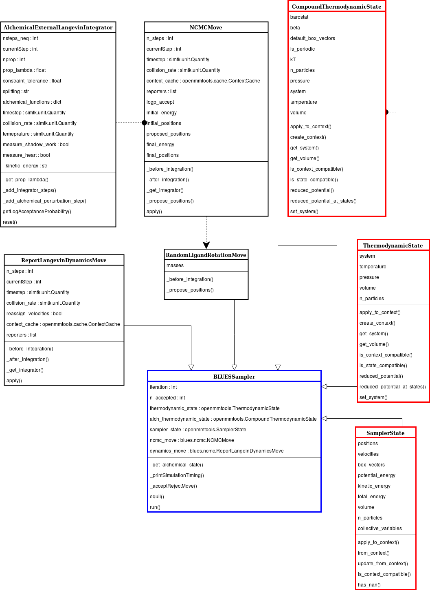

Developer Guide
=======================
UML Diagram
-----------


OpenMMTools Objects
-------------------
Highlighted in red are 3 objects that we use from the ``openmmtools`` library. They are the **ThermodynamicState**, **CompoundThermodynamicState**, and **SamplerState** objects. For more details of each class, please see the official `openmmtools documentation <https://openmmtools.readthedocs.io/en/0.18.1/states.html#thermodynamic-and-sampler-states>`_.

Briefly, the **ThermodynamicState** class represents the portion of the state of an ``openmm.Context`` that does not change with integration (i.e. particles, temperature, or pressure). The **CompoundThermodynamicState** class is essentially the same as the **ThermodynamicState** class except in this package, it is used for the handling the ``openmmtools.alchemy.AlchemicalState`` object. Thus, in order to create the **CompoundThermodynamicState**, one needs to first create the plain **ThermodynamicState** object first. If a **CompoundThermodynamicState** object is not provided to the ``blues.ncmc.BLUESSampler`` class, one is created using the default parameters from the given **ThermodynamicState**. Lastly, the **SamplerState** class represents the state of an ``openmm.Context`` which does change with integration (i.e positions, velocities, and box_vectors). Within the context of this package, the **SamplerState** is used to sync information between the MD and NCMC simulations.

Integrators and Moves
---------------------
**Integrators**
Integrators are the lowest level openmm objects this package interacts with, where each intergrator is tied to an ``openmm.Context`` that it advances. Each integrator is generated by using the embedded function ``_get_integrator()`` function within each move class. The integrators will control whether we are carrying out the Non-equilibirum Candidate Monte Carlo (NCMC) or Molecular Dynamics (MD) simulation.

Every move class has 3 hidden methods: ``_get_integrator()`` for generating the integrator of each move class, ``_before_integration()`` for performing any necessary setup before integration, and ``_after_integration()`` for performing any cleanup or data collection after integration. Every move class also contains the ``apply()`` method which carries out calls to the 3 hidden methods and stepping with the integrator.

In this package, we provide the move class ``blues.ncmc.ReportLangevinDynamicsMove`` to execute the MD simulation. As the name suggests, this will carry forward the MD simulation using Langevin dynamics, by generating an ``openmm.LangevinIntegrator``. This class is essentially the same as the ``openmmtools.LangevinDynamicsMove`` but with modifications to the ``apply()`` method which allows storing simulation data for the MD simulation.

For running the NCMC simulation, we provide a custom integrator
``blues.integrator.AlchemicalExternalLangevinIntegrator``. This integrator is generated in every move which inherits from the base class ``blues.ncmc.NCMCMove``. Every class which inherits from the base move class must override the ``_propose_positions()`` method. If necessary, one can override the ``_before_integration()`` and ``_after_integration()`` methods for any necessary setup and cleanup. Again, these hidden methods will be called when a call is made to the ``apply()`` method from the move class.

**Moves**
In order to implement custom NCMC moves, inherit from the base class and override the ``_propose_positions()`` method. This method is expected to take in a positions array of the atoms to be modified and returns the proposed positions. In pseudo-code, it would look something like:

.. code-block:: python

   from blues.ncmc import NCMCMove
   class CustomNCMCMove(NCMCMove):
       def _propose_positions(positions):
           """Add 1 nanometer displacement vector."""
           positions_unit = positions.unit
           unitless_displacement = 1.0 / positions_unit
           displacement_vector = unit.Quantity(np.random.randn(3) * unitless_displacement_sigma, positions_unit)
           proposed_positions = positions + displacement_vector
           return proposed_positions

In this package, we provide the ``blues.ncmc.RandomLigandRotationMove`` in order to propose a random ligand rotation about the center of mass. This class overrides the ``_before_integration()`` method for obtaining the masses of the ligand and overrides the ``_propose_positions()`` function for generating the rotated coordinates. Updating the context with the rotated coordinates is handled when the ``apply()`` method is called in the move class. Code snippet of the class is shown below:

.. code-block:: python

   from blues.ncmc import RandomLigandRotationMove
   class RandomLigandRotationMove(NCMCMove):
      def _before_integration(self, context, thermodynamic_state):
         """Obtain the masses of the ligand before integration."""
         super(RandomLigandRotationMove, self)._before_integration(context, thermodynamic_state)
         masses, totalmass = utils.getMasses(self.atom_subset, thermodynamic_state.topology)
         self.masses = masses
      def _propose_positions(self, positions):
          # Calculate the center of mass
          center_of_mass = utils.getCenterOfMass(positions, self.masses)
          reduced_pos = positions - center_of_mass
          # Define random rotational move on the ligand
          rand_quat = mdtraj.utils.uniform_quaternion(size=None)
          rand_rotation_matrix = mdtraj.utils.rotation_matrix_from_quaternion(rand_quat)
          # multiply lig coordinates by rot matrix and add back COM translation from origin
          proposed_positions = numpy.dot(reduced_pos, rand_rotation_matrix) * positions.unit + center_of_mass

          return proposed_positions

Since BLUES (v0.2.5) the API has been re-written to be more compatible with the ``openmmtools`` API. This means one can turn a regular `Markov Chain Monte Carlo (MCMC) <https://openmmtools.readthedocs.io/en/0.18.1/mcmc.html#mcmc-move-types>`_ move from the ``openmmtools`` library into an NCMC move to be used in this package. In this case, one simply needs to make use of dual inheritance, using the ``blues.ncmc.NCMCMove`` that we provide and override the ``_get_integrator()`` method to generate the NCMC integrator we provide, i.e. ``blues.integrator.AlchemicalExternalLangevinIntegrator``. When using dual inheritance, it is important that you first inherit the desired MCMC move and then the ``blues.ncmc.NCMCMove`` class. For example, if we wanted to take the ``openmmtools.mcmc.MCDisplacementMove`` class and turn it into an NCMC move, it would look like:

.. code-block:: python

   from blues.ncmc import NCMCMove
   from openmmtools.mcmc import MCDisplacementMove
   class NCMCDisplacementMove(MCDisplacementMove, NCMCMove):
       def _get_integrator(self, thermodynamic_state):
           return NCMCMove._get_integrator(self,thermodynamic_state)

BLUESSampler
------------
The ``blues.ncmc.BLUESSampler`` object ties together all the previously mentioned state objects and the two move classes for running the NCMC+MD simulation. Details of the parameters for this class are listed in the :doc:`module_doc` documentation. For a more detailed example of it's usage see the :doc:`usage` documentation.

To be explicit, the input parameters refer to the objects below:

- **thermodynamic_state** : ``openmmtools.states.ThermodynamicState``
- **alch_thermodynamic_state** : ``openmmtools.states.CompoundThermodynamicState``
- **sampler_state** : ``openmmtools.states.SamplerState``
- **dynamics_move** : ``blues.ncmc.ReportLangevinDynamicsMove``
- **ncmc_move** : ``blues.ncmc.RandomLigandRotationMove``
- **topology** : ``openmm.Topology``

When the ``run()`` method in the ``blues.ncmc.BLUESSampler`` is called the following takes place:

- Initialization:
   - ``_printSimulationTiming()`` : Calculation of total number of steps
   - ``equil()`` : Equilibration
- BLUES iterations:
   - ``ncmc_move.apply()`` : NCMC simulation
   - ``_acceptRejectMove()`` : Metropolization
   - ``dynamics_move.apply()`` : MD Simulation

A code snippet of the ``run()`` method is shown below:

.. code-block:: python

   def run(self, n_iterations=1):
       self._printSimulationTiming(n_iterations)
       if self.iteration == 0:
           self.equil(1)

       self.iteration = 0
       for iteration in range(n_iterations):
           self.ncmc_move.apply(self.alch_thermodynamic_state, self.sampler_state)

           self._acceptRejectMove()

           self.dynamics_move.apply(self.thermodynamic_state, self.sampler_state)

           self.iteration += 1


Initialization
``````````````
The first thing that occurs when ``run()`` is called is the initialization stage. During this stage, a call is made to ``_printSimulationTiming()`` method which will print out the total number of force evaluations and simulation time. The output will look something like below:

.. code-block:: python

   Total BLUES Simulation Time = 4.0 ps (0.04 ps/Iter)
   Total Force Evaluations = 4000
   Total NCMC time = 2.0 ps (0.02 ps/iter)
   Total MD time = 2.0 ps (0.02 ps/iter)

In the ``blues.ncmc.BLUESSampler`` class, there is an ``equil()`` method which lets you run iterations of just the MD simulation in order to equilibrate your system before running the NCMC+MD hybrid simulation. An equilibration iteration, in this case is controlled by the given attribute *n_steps* from the *dynamics_move* class. For example, if I create a ``blues.ncmc.ReportLangevinDynamicsMove`` class with *n_steps=20* and call the ``blues.ncmc.BLUESSampler.equil(n_iterations=100)``, this will run *(n_steps x n_iterations)* or 2000 steps of MD or 2 picoseconds of MD simulation time. When the ``run()`` method is called without a prior call to the ``equil()`` method, the class will always run 1 iteration of equilibration in order to set the initial conditions in the MD simulation. This is required prior to running the NCMC simulation.

BLUES Iterations
````````````````
**NCMC Simulation**
After at least 1 iteration of equilibration, the ``blues.ncmc.BLUESSampler`` class will then proceed forward with running iterations of the NCMC+MD hybrid simulation. It will first run the NCMC simulation by calling the ``apply()`` method on the **ncmc_move** class or, for sake of this example, the ``blues.ncmc.RandomLigandRotationMove`` class. The ``apply()`` method for the **ncmc_move** will take in the **alch_thermodynamic_state** parameter or specifically the ``openmmtools.states.CompoundThermodynamicState`` object.

A code snippet of the ``ncmc_move.apply()`` method is shown below:

.. code-block:: python

   def apply(self, thermodynamic_state, sampler_state):
       if self.context_cache is None:
           context_cache = cache.global_context_cache
       else:
           context_cache = self.context_cache
       integrator = self._get_integrator(thermodynamic_state)
       context, integrator = context_cache.get_context(thermodynamic_state, integrator)
       sampler_state.apply_to_context(context, ignore_velocities=False)
       self._before_integration(context, thermodynamic_state)
       try:
           endStep = self.currentStep + self.n_steps
           while self.currentStep < endStep:
               nextSteps = endStep - self.currentStep
               stepsToGo = nextSteps
               while stepsToGo > 10:
                   integrator.step(10)
                   stepsToGo -= 10
               integrator.step(stepsToGo)
               self.currentStep += nextSteps

               alch_lambda = integrator.getGlobalVariableByName('lambda')
               if alch_lambda == 0.5:
                   sampler_state.update_from_context(context)
                   proposed_positions = self._propose_positions(sampler_state.positions[self.atom_subset])
                   sampler_state.positions[self.atom_subset] = proposed_positions
                   sampler_state.apply_to_context(context, ignore_velocities=True)
       except Exception as e:
           print(e)
       else:
           context_state = context.getState(
               getPositions=True,
               getVelocities=True,
               getEnergy=True,
               enforcePeriodicBox=thermodynamic_state.is_periodic)

           self._after_integration(context, thermodynamic_state)
           sampler_state.update_from_context(
               context_state, ignore_positions=False, ignore_velocities=False, ignore_collective_variables=True)
           sampler_state.update_from_context(
               context, ignore_positions=True, ignore_velocities=True, ignore_collective_variables=False)

When the ``apply()`` method on **ncmc_move** is called, it will first generate the ``blues.integrators.AlchemicalExternalLangevinIntegrator`` by calling the ``_get_integrator()`` method inherent to the move class. Then, it will create (or fetch from the **context_cache**) a corresponding ``openmm.Context`` given the **alch_thermodynamic_state**. Next, the **sampler_state** which contains the last state of the MD simulation is synced to the newly created context from the corresponding **alch_thermodynamic_state**. Particularly, the context will be updated with the *box_vectors*, *positions*, and *velocities* from the last state of the MD simulation.

Just prior to integration, a call is made to the ``_before_integration()`` method in order to store the initial *energies*, *positions* and the *masses* of the ligand to be rotated. Then, we actually step with the integrator where we perform the ligand rotation when *lambda* has reached the half-way point or *lambda=0.5*, continuing integration until we have completed the *n_steps*. After the integration steps have been completed, a call is made to the ``_after_integration()`` method to store the final *energies* and *positions*. Lastly, the **sampler_state** is updated from the final state of the context.


**Metropolization**
After advancing the NCMC simulation, a call is made to the ``_acceptRejectMove()`` method embedded in the ``blues.ncmc.BLUESSampler`` class for metropolization of the proposed move.

A code snippet of the ``_acceptRejectMove()`` is shown below:

.. code-block:: python

   def _acceptRejectMove(self):
       integrator = self.dynamics_move._get_integrator(self.thermodynamic_state)
       context, integrator = cache.global_context_cache.get_context(self.thermodynamic_state, integrator)
       self.sampler_state.apply_to_context(context, ignore_velocities=True)
       alch_energy = self.thermodynamic_state.reduced_potential(context)

       correction_factor = (self.ncmc_move.initial_energy - self.dynamics_move.final_energy + alch_energy -
                           self.ncmc_move.final_energy)
       logp_accept = self.ncmc_move.logp_accept
       randnum = numpy.log(numpy.random.random())

       logp_accept = logp_accept + correction_factor
       if (not numpy.isnan(logp_accept) and logp_accept > randnum):
           self.n_accepted += 1
       else:
           self.accept = False
           self.sampler_state.positions = self.ncmc_move.initial_positions

Here, is we compute a correction term for switching between the MD and NCMC integrators and factor this in with natural log of the acceptance probability (**logp_accept**). Then, a random number is generated in which: the move is accepted if the random number is less than the **logp_accept** or rejected if greater. When the move is rejected, we set the positions on the **sampler_state** to the initial positions from the NCMC simulation. If the move is accepted, nothing on the **sampler_state** is changed so that the following MD simulation will contain the final state of the NCMC simulation.

**MD Simulation**
After metropolization of the previously proposed move, a call is made to the ``apply()`` method on the given **dynamics_move** object. In this example, this would refer to the ``blues.ncmc.ReportLangevinDynamicsMove`` class to run the MD simulation.

A code snippet of the ``dynamics_move.apply()`` method is shown below:

.. code-block:: python

   def apply(self, thermodynamic_state, sampler_state):
       if self.context_cache is None:
           context_cache = cache.global_context_cache
       else:
           context_cache = self.context_cache

       integrator = self._get_integrator(thermodynamic_state)
       context, integrator = context_cache.get_context(thermodynamic_state, integrator)
       thermodynamic_state.apply_to_context(context)

       sampler_state.apply_to_context(context, ignore_velocities=self.reassign_velocities)
       if self.reassign_velocities:
           context.setVelocitiesToTemperature(thermodynamic_state.temperature)

       self._before_integration(context, thermodynamic_state)
       try:
           endStep = self.currentStep + self.n_steps
           while self.currentStep < endStep:
               nextSteps = endStep - self.currentStep
               stepsToGo = nextSteps
               while stepsToGo > 10:
                   integrator.step(10)
                   stepsToGo -= 10
               integrator.step(stepsToGo)
               self.currentStep += nextSteps

       except Exception as e:
           print(e)

       else:
           context_state = context.getState(
               getPositions=True,
               getVelocities=True,
               getEnergy=True,
               enforcePeriodicBox=thermodynamic_state.is_periodic)
           self._after_integration(context, thermodynamic_state)
           sampler_state.update_from_context(
               context_state, ignore_positions=False, ignore_velocities=False, ignore_collective_variables=True)
           sampler_state.update_from_context(
               context, ignore_positions=True, ignore_velocities=True, ignore_collective_variables=False)

When the ``apply()`` method is called, a very similar procedure to the NCMC simulation occurs. The first thing that happens is to generate the integrator through a call to ``_get_integrator()``, where in this given class, it will generate an ``openmm.LangevinIntegrator`` given the **thermodynamic_state** parameter. Then, it will create (or fetch from the **context_cache**) a corresponding ``openmm.Context`` given the **thermodynamic_state**. Next, the **sampler_state**, which contains the last state of the NCMC simulation if the previous move was accepted or the initial state of the NCMC simulation if the move was rejected, is used to update *box_vectors* and *positions* in the newly created ``openmm.Context``. In this case, we reassign the *velocities* in the MD simulation in order to preserve detailed balance.

Following, a call is made to ``_before_integration()`` to store the intial *positions* and *energies* and then we carry forward with the integration for *n_steps*. After the integration steps have been completed, a call is made to the ``_after_integration()`` method to store the final *energies* and *positions*. Lastly, the **sampler_state** object is updated from the final state of the MD simulation context.

This completes 1 iteration of the BLUES cycle. Here, the **sampler_state** is then used to sync the final state of the MD simulation (i.e. *box_vectors*, *positions*, and *velocities*) from the previous iteration to the NCMC simulation of the next iteration. Then, we repeat the cycle of **NCMC -> Metropolization -> MD** for the given number of iterations.
