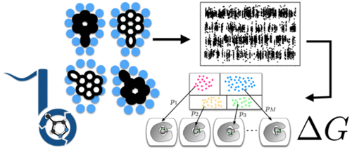
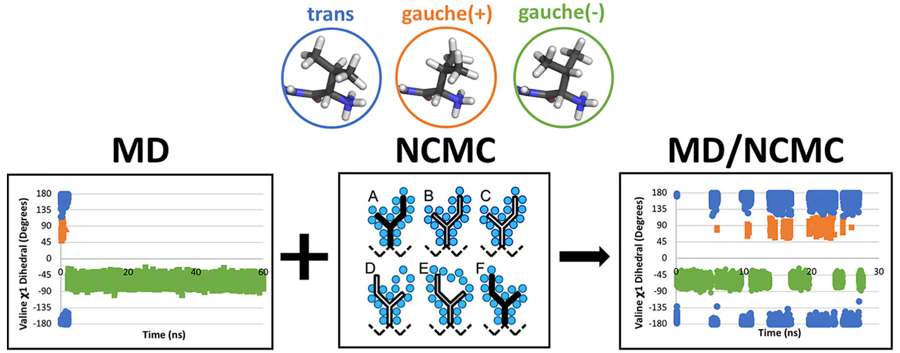

Introduction
============
.. figure:: ../images/blues.png
   :scale: 15 %
   :target: https://github.com/MobleyLab/blues

   BLUES is a python package that takes advantage of non-equilibrium candidate Monte Carlo moves (NCMC) to help sample between different ligand binding modes.

Github
------
.. role:: raw-html(raw)
   :format: html

:raw-html:`<a class="github-button" href="https://github.com/mobleylab/blues" data-size="large" data-show-count="false" aria-label="Star mobleylab/blues on GitHub">Github</a>` Check out our Github repository.

:raw-html:`<a class="github-button" href="https://github.com/mobleylab/blues/issues" data-icon="octicon-issue-opened" data-size="large" data-show-count="false" aria-label="Issue mobleylab/blues on GitHub">Issue</a>` If you have any problems or suggestions through our issue tracker.

:raw-html:`<a class="github-button" href="https://github.com/mobleylab/blues/fork" data-icon="octicon-repo-forked" data-size="large" aria-label="Fork mobleylab/blues on GitHub">Fork</a>` To contribute to our code, please fork our repository and open a Pull Request.

.. image:: https://travis-ci.org/MobleyLab/blues.svg?branch=master
   :target: https://travis-ci.org/MobleyLab/blues

.. image:: https://readthedocs.org/projects/mobleylab-blues/badge/?version=latest
   :target: https://mobleylab-blues.readthedocs.io/en/latest/?badge=latest
   :alt: Documentation Status

.. image:: https://codecov.io/gh/MobleyLab/blues/branch/master/graph/badge.svg
     :target: https://codecov.io/gh/MobleyLab/blues

.. image:: https://anaconda.org/mobleylab/blues/badges/version.svg
   :target: https://anaconda.org/mobleylab/blues

.. image:: https://zenodo.org/badge/62096511.svg
   :target: https://zenodo.org/badge/latestdoi/62096511

Publication
-----------

.. rubric:: Binding Modes of Ligands Using Enhanced Sampling (BLUES): Rapid Decorrelation of Ligand Binding Modes via Nonequilibrium Candidate Monte Carlo

Samuel C. Gill, Nathan M. Lim, Patrick B. Grinaway, Ariën S. Rustenburg, Josh Fass, Gregory A. Ross, John D. Chodera , and David L. Mobley

*Journal of Physical Chemistry B* **2018** *122* (21), 5579-5598

**DOI:** `10.1021/acs.jpcb.7b11820 <https://pubs.acs.org/doi/abs/10.1021/acs.jpcb.7b11820>`_

Publication Date (Web): February 27, 2018

.. rubric:: Abstract

.. epigraph::
   Accurately predicting protein–ligand binding affinities and binding modes is a major goal in computational chemistry, but even the prediction of ligand binding modes in proteins poses major challenges. Here, we focus on solving the binding mode prediction problem for rigid fragments. That is, we focus on computing the dominant placement, conformation, and orientations of a relatively rigid, fragment-like ligand in a receptor, and the populations of the multiple binding modes which may be relevant. This problem is important in its own right, but is even more timely given the recent success of alchemical free energy calculations. Alchemical calculations are increasingly used to predict binding free energies of ligands to receptors. However, the accuracy of these calculations is dependent on proper sampling of the relevant ligand binding modes. Unfortunately, ligand binding modes may often be uncertain, hard to predict, and/or slow to interconvert on simulation time scales, so proper sampling with current techniques can require prohibitively long simulations. We need new methods which dramatically improve sampling of ligand binding modes. Here, we develop and apply a nonequilibrium candidate Monte Carlo (NCMC) method to improve sampling of ligand binding modes. In this technique, the ligand is rotated and subsequently allowed to relax in its new position through alchemical perturbation before accepting or rejecting the rotation and relaxation as a nonequilibrium Monte Carlo move. When applied to a T4 lysozyme model binding system, this NCMC method shows over 2 orders of magnitude improvement in binding mode sampling efficiency compared to a brute force molecular dynamics simulation. This is a first step toward applying this methodology to pharmaceutically relevant binding of fragments and, eventually, drug-like molecules. We are making this approach available via our new Binding modes of ligands using enhanced sampling (BLUES) package which is freely available on GitHub.

Citations
---------

.. rubric:: Enhancing Side Chain Rotamer Sampling Using Nonequilibrium Candidate Monte Carlo

Kalistyn H. Burley, Samuel C. Gill, Nathan M. Lim, and David L. Mobley

*Journal of Chemical Theory and Computation.* **2019** *15* (3), 1848-1862

**DOI:** `10.1021/acs.jctc.8b01018` <https://pubs.acs.org/doi/abs/10.1021/acs.jctc.8b01018>

Publication Date (Web): January 24, 2019

.. rubric:: Abstract

.. epigraph::
   Molecular simulations are a valuable tool for studying biomolecular motions and thermodynamics. However, such motions can be slow compared to simulation time scales, yet critical. Specifically, adequate sampling of side chain motions in protein binding pockets is crucial for obtaining accurate estimates of ligand binding free energies from molecular simulations. The time scale of side chain rotamer flips can range from a few ps to several hundred ns or longer, particularly in crowded environments like the interior of proteins. Here, we apply a mixed nonequilibrium candidate Monte Carlo (NCMC)/molecular dynamics (MD) method to enhance sampling of side chain rotamers. The NCMC portion of our method applies a switching protocol wherein the steric and electrostatic interactions between target side chain atoms and the surrounding environment are cycled off and then back on during the course of a move proposal. Between NCMC move proposals, simulation of the system continues via traditional molecular dynamics. Here, we first validate this approach on a simple, solvated valine-alanine dipeptide system and then apply it to a well-studied model ligand binding site in T4 lysozyme L99A. We compute the rate of rotamer transitions for a valine side chain using our approach and compare it to that of traditional molecular dynamics simulations. Here, we show that our NCMC/MD method substantially enhances side chain sampling, especially in systems where the torsional barrier to rotation is high (≥10 kcal/mol). These barriers can be intrinsic torsional barriers or steric barriers imposed by the environment. Overall, this may provide a promising strategy to selectively improve side chain sampling in molecular simulations.

Theory
------
Suggested readings:

.. [1] `Best Practices for Foundations in Molecular Simulations : v1.0. Efrem Braun, Justin Gilmer, Heather B. Mayes, David L. Mobley, Jacob I. Monroe, Samarjeet Prasad, Daniel M. Zuckerman.  <https://github.com/MobleyLab/basic_simulation_training/blob/master/paper/basic_training.pdf>`_
.. [2] `Nonequilibrium candidate Monte Carlo is an efficient tool for equilibrium simulation. Jerome P. Nilmeier, Gavin E. Crooks, David D. L. Minh, and John D. Chodera. PNAS November 8, 2011. 108 (45) E1009-E1018 <http://www.pnas.org/content/108/45/E1009>`_
